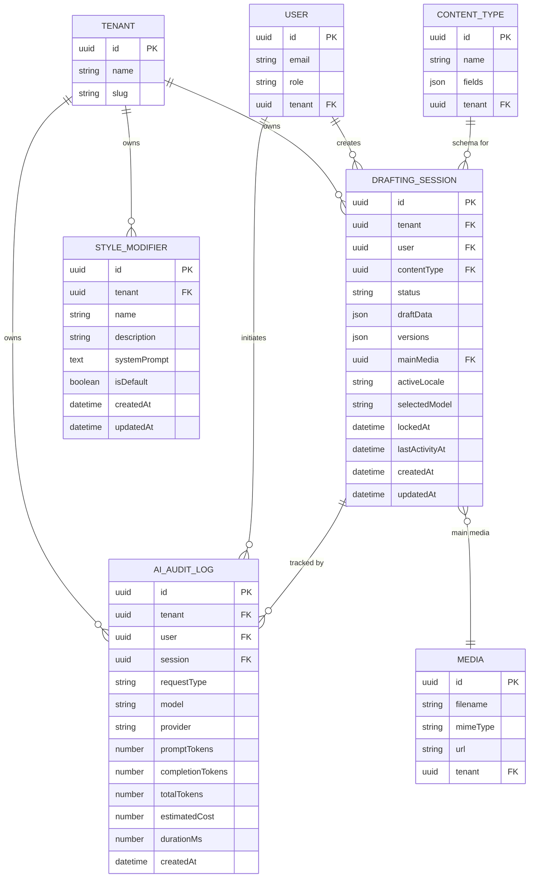
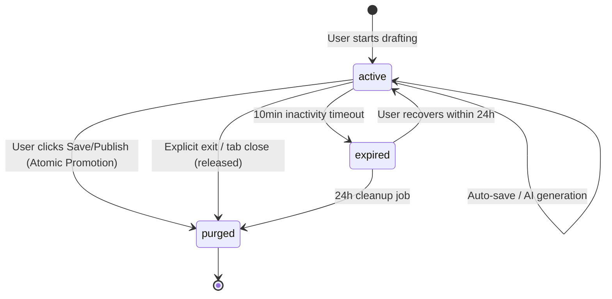

# Data Model: AI Content Drafting

**Feature**: 004-ai-content-drafting  
**Date**: 2026-05-18  
**Derived From**: `spec.md` (FR-001–FR-018), `research.md`

---

## Entity Relationship Diagram

---

## Entity Definitions

### 1. DraftingSession (New — Payload CMS Collection)

**Slug**: `drafting-sessions`  
**Multi-tenant**: Yes (via `@payloadcms/plugin-multi-tenant`)  
**Purpose**: Represents the active state of an AI drafting interaction. Acts as a temporary workspace until the user promotes the draft to a `ContentItem`.

| Field | Type | Required | Default | Description |
|-------|------|----------|---------|-------------|
| `id` | uuid | auto | auto | Primary key |
| `tenant` | relationship → Tenants | yes | — | Owning tenant (plugin-managed) |
| `user` | relationship → Users | yes | — | User who owns the session |
| `contentType` | relationship → ContentTypes | yes | — | Target schema for the draft |
| `status` | select | yes | `active` | Lifecycle state: `active`, `expired` |
| `draftData` | json | yes | `{}` | Current field values as `{ fieldName: value }` map. Rich-text Body stored as Lexical JSON. |
| `versions` | json | no | `[]` | Array of up to 10 snapshot objects: `[{ timestamp, draftData, mainMedia }]` |
| `mainMedia` | relationship → Media | no | — | Reference to AI-generated or uploaded main media |
| `activeLocale` | text | no | `en` | The locale this drafting session is scoped to |
| `selectedModel` | text | no | — | User-overridden LLM model identifier (null = tenant default) |
| `lockedAt` | date | yes | now | Timestamp when the lock was acquired |
| `lastActivityAt` | date | yes | now | Updated on every auto-save; used for inactivity timeout |
| `createdAt` | date | auto | now | Creation timestamp |
| `updatedAt` | date | auto | now | Last modification timestamp |

**Validation Rules**:
- **Database-Level Lock (CRITICAL)**: A **partial unique index** on `(tenant, contentType)` WHERE `status = 'active'`. This is the authoritative single-user lock — the DB itself rejects concurrent session creation, eliminating race conditions entirely.
- **Advisory Hook**: A `beforeChange` hook on create also queries for existing active sessions and returns a user-friendly 409 error message. This is a UX layer, NOT the sole lock mechanism.
- `versions` array capped at 10 entries via `beforeChange` hook (FIFO trimming).
- `status` transitions: `active → expired` (timeout), `active` (deleted/purged on save/publish/release), `expired → active` (recovery).

**Performance Optimization (versions field)**:
- The `versions` field stores up to 10 full snapshots of `draftData` (including `mainMedia` reference), which can contain verbose Lexical JSON. To prevent this from degrading lock-check queries and list views, the collection config MUST set `admin.hidden: true` on the `versions` field and use `select: false` (or equivalent Payload field-level access) to exclude it from list queries.
- The `versions` data is only fetched on explicit document-by-ID requests when the user opens the version selector UI.

**State Transitions**:

**Access Control**:
- `create`: Authenticated tenant users with content create permission.
- `read`: Owner user only (or super-admin).
- `update`: Owner user only.
- `delete`: System (hooks) or super-admin.

---

### 2. StyleModifier (New — Payload CMS Collection)

**Slug**: `style-modifiers`  
**Multi-tenant**: Yes (via `@payloadcms/plugin-multi-tenant`)  
**Purpose**: Defines custom brand tone prompts that are injected into AI generation requests.

| Field | Type | Required | Default | Description |
|-------|------|----------|---------|-------------|
| `id` | uuid | auto | auto | Primary key |
| `tenant` | relationship → Tenants | yes | — | Owning tenant (plugin-managed) |
| `name` | text | yes | — | Display name (e.g., "Academic", "Punchy", "Technical") |
| `description` | textarea | no | — | Brief description for the UI selector |
| `systemPrompt` | textarea | yes | — | System prompt text injected into AI requests |
| `isDefault` | checkbox | no | `false` | Whether this is the tenant's default tone |
| `createdAt` | date | auto | now | |
| `updatedAt` | date | auto | now | |

**Validation Rules**:
- `name` + `tenant`: unique compound (no duplicate tone names per tenant).
- Only one `isDefault = true` per tenant (enforced via `beforeChange` hook).

**Access Control**:
- `create/update/delete`: Tenant admins only.
- `read`: All authenticated tenant users.

---

### 3. AIAuditLog (New — Payload CMS Collection)

**Slug**: `ai-audit-logs`  
**Multi-tenant**: Yes (via `@payloadcms/plugin-multi-tenant`)  
**Purpose**: Immutable audit trail for every AI request, enabling usage tracking, cost attribution, and compliance.

| Field | Type | Required | Default | Description |
|-------|------|----------|---------|-------------|
| `id` | uuid | auto | auto | Primary key |
| `tenant` | relationship → Tenants | yes | — | Owning tenant (plugin-managed) |
| `user` | relationship → Users | yes | — | Requesting user |
| `session` | relationship → DraftingSessions | no | — | DraftingSession reference (optional) |
| `requestType` | select | yes | — | `draft`, `refine`, `image-generate`, `schema-create` |
| `prompt` | textarea | no | — | User prompt (truncated to 500 chars for storage) |
| `model` | text | yes | — | LLM model identifier used |
| `provider` | text | yes | — | Provider name (openai, anthropic, google, nvidia) |
| `promptTokens` | number | no | 0 | Input token count |
| `completionTokens` | number | no | 0 | Output token count |
| `totalTokens` | number | no | 0 | Total token count |
| `estimatedCost` | number | no | 0 | Cost in USD microdollars ($1 = 1,000,000 microdollars) |
| `durationMs` | number | no | 0 | Request duration in milliseconds |
| `status` | select | yes | — | `success`, `error`, `timeout` |
| `errorMessage` | text | no | — | Error details if status is `error` |
| `createdAt` | date | auto | now | |

**Validation Rules**:
- Immutable: No `update` or `delete` operations via API (admin-only read access).
- `totalTokens = promptTokens + completionTokens` (validated in hook).

**Access Control**:
- `create`: System only (internal service calls).
- `read`: Tenant admins and super-admins.
- `update/delete`: Disabled.

---

### 4. AISuggestion (Ephemeral — Client-Side State)

**Purpose**: Tracks individual field suggestions for "refresh" and "undo" actions. NOT persisted as a separate collection — stored as part of the React component state on the client.

| Property | Type | Description |
|----------|------|-------------|
| `fieldName` | string | The schema field this suggestion applies to |
| `currentValue` | string/json | The current AI-suggested value |
| `previousValue` | string/json | The value before this suggestion (for undo) |
| `status` | enum | `pending`, `accepted`, `rejected`, `refreshing` |
| `generatedAt` | datetime | When the suggestion was created |

**Rationale**: AISuggestions are transient UI state. They are implicitly persisted through the `draftData` field of `DraftingSession` when auto-saved.

---

### 5. AIRateLimits (New — Payload CMS Collection)

**Slug**: `ai-rate-limits`  
**Multi-tenant**: No (user-scoped, not tenant-scoped — rate limits are per-user globally)  
**Purpose**: Postgres-backed sliding window counter for enforcing 10 AI requests/minute/user. Required for correctness under multi-pod Kubernetes deployments.

| Field | Type | Required | Default | Description |
|-------|------|----------|---------|-------------|
| `id` | uuid | auto | auto | Primary key |
| `userId` | text | yes | — | The user ID making the request |
| `requestTimestamp` | date | yes | now | When the request was made |
| `requestPath` | text | yes | — | The API endpoint path (e.g., /api/ai/draft) |

**Validation Rules**:
- No update operations — insert-only.
- Periodic cleanup job deletes rows older than 5 minutes.

**Access Control**:
- `create`: System only (internal rate limiter service).
- `read/update/delete`: Disabled via API.

---

### 6. ContentDraft (Value Object — AI Service Domain)

**Location**: `apps/content-authoring-service/src/domain/content_drafting/models.py`  
**Purpose**: Domain value object representing a drafted content structure in the AI service's bounded context.

| Property | Type | Description |
|----------|------|-------------|
| `schema_name` | str | Name of the target ContentType |
| `fields` | list[DraftField] | Generated field values |
| `style_modifier` | str | null | Active tone/style prompt |
| `locale` | str | Target locale |
| `model` | str | LLM model used |

**DraftField Value Object**:

| Property | Type | Description |
|----------|------|-------------|
| `name` | str | Field name from schema |
| `type` | str | Field type (text, richText, etc.) |
| `value` | Any | Generated value (Markdown for richText) |
| `status` | str | `generating`, `complete`, `error` |

---

### 7. AIAgentSession (New — AI Microservice SQLAlchemy Model)

**Database**: `hermes_authoring` (port 5433)  
**Location**: `apps/content-authoring-service/src/infrastructure/models.py`  
**Purpose**: Persisted session logs in the AI microservice's own data store, enabling chat context continuity and RAG features as mandated by the Project Constitution (Principle VII).

| Field | Type | Required | Default | Description |
|-------|------|----------|---------|-------------|
| `id` | uuid | yes | auto | Primary key |
| `tenant_id` | text | yes | — | Owning tenant identifier (strict separation context) |
| `user_id` | text | yes | — | Requesting user identifier |
| `session_id` | text | yes | — | Session ID correlating to Payload's DraftingSession |
| `contentType_id` | text | yes | — | Target ContentType identifier |
| `messages` | jsonb | yes | `[]` | Message list in standard LangChain format for context continuity |
| `model` | text | yes | — | The LLM model used for the drafting |
| `created_at` | datetime | yes | now | |
| `updated_at` | datetime | yes | now | |

**Validation Rules**:
- Compound unique index on `(tenant_id, session_id)` to enable quick context resolution and prevent duplicate session contexts per tenant.

---

## Indexes

| Collection / Table | Index | Type | Purpose |
|-----------|-------|------|---------|
| `drafting-sessions` | `(tenant, contentType) WHERE status='active'` | **Partial unique** | Database-level single-user lock (race-condition-proof) |
| `drafting-sessions` | `(lastActivityAt)` | Single | Inactivity timeout query |
| `drafting-sessions` | `(status, updatedAt)` | Compound | Expired session cleanup |
| `ai-audit-logs` | `(tenant, createdAt)` | Compound | Tenant usage queries |
| `ai-audit-logs` | `(user, createdAt)` | Compound | User usage queries |
| `ai-rate-limits` | `(userId, requestTimestamp)` | Compound | Sliding window rate limit lookups |
| `style-modifiers` | `(tenant, name)` | Compound unique | No duplicate names per tenant |
| `ai_agent_sessions` | `(tenant_id, session_id)` | Compound unique | Fast RAG / chat history lookup per session |
