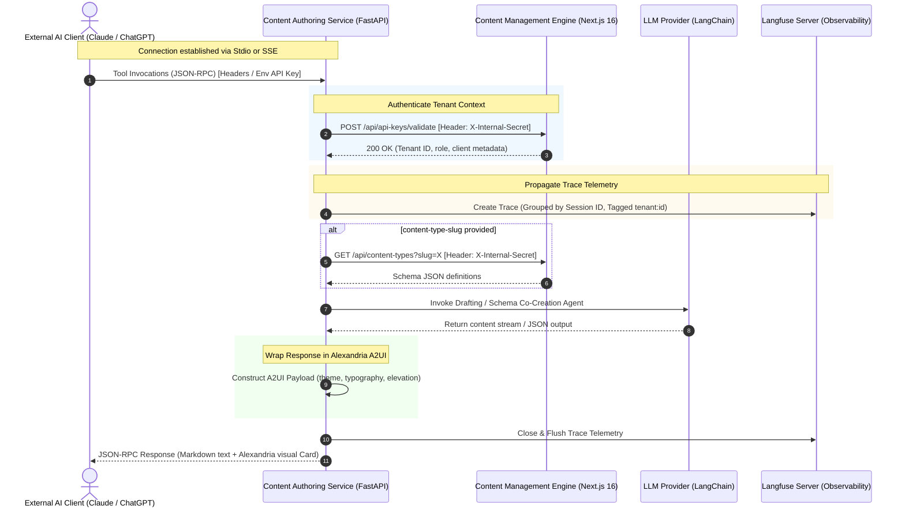

# Developer & Operator Manual: A2A, MCP & A2UI Integration

This manual provides a comprehensive guide to setting up, using, and troubleshooting the **Agent-to-Agent (A2A)** and **Model Context Protocol (MCP)** integration in Hermes AI. It also covers the custom **Agent-to-UI / Agent-Generated UI (A2UI/AGUI)** visual response standard.

---

## 1. Architectural Blueprint

The A2A & MCP integration exposes the capabilities of the **FastAPI Content Authoring Service** directly to external AI assistants (such as Claude Desktop, ChatGPT, or custom remote agents). 

The following diagram illustrates how incoming requests (Stdio or SSE) propagate through the hybrid architecture, validate credentials against the CMS monolith, utilize agents, and trace telemetry to Langfuse:



---

## 2. Prerequisites & Stack Configuration

Before configuring external integrations, ensure your local Hermes AI development stack is fully operational:

### 1. Environment Secrets Configuration
Ensure both applications have matching communication credentials in their environment:
* **CMS Engine (`apps/content-management-engine/.env`)**:
  ```env
  INTERNAL_SERVICE_SECRET="your-high-entropy-internal-secret"
  ```
* **AI Service (`apps/content-authoring-service/.env` or Docker env)**:
  ```env
  INTERNAL_SERVICE_SECRET="your-high-entropy-internal-secret"
  CMS_ENGINE_URL="http://localhost:3000"
  ```

### 2. Launch the Local Infrastructure & Services
Run the following script from the repository root to start PostgreSQL databases, Kafka message brokers, the Next.js engine, and the FastAPI service:
```bash
./scripts/start-local.sh
```
> [!NOTE]
> If running on Windows, use `.\scripts\start-local.ps1` in PowerShell. By default, this starts all applications and includes Langfuse tracing on port `3003`.

---

## 3. Local Developer Setup (Stdio & Claude Desktop)

Local AI clients (e.g., **Claude Desktop**) connect to the Hermes MCP Server via standard input/output (Stdio) streams.

### 1. Create a Tenant API Key
1. Open the Hermes CMS admin portal: `http://localhost:3000/admin`.
2. Log in using your developer credentials.
3. In the sidebar, select **API Keys** collection.
4. Click **Create New API Key**. Make sure to:
   - Give it a descriptive name (e.g., `Claude Desktop Key`).
   - Select your target **Tenant** scope.
   - Copy the generated API Key.

### 2. Configure Claude Desktop
Open the Claude Desktop configuration file in your system editor:
* **macOS/Linux**: `~/Library/Application Support/Claude/claude_desktop_config.json`
* **Windows**: `%APPDATA%\Claude\claude_desktop_config.json`

Add the `hermes-mcp` definition under `mcpServers`:

```json
{
  "mcpServers": {
    "hermes-mcp": {
      "command": "/bin/bash",
      "args": ["-c", "/home/itlight/dev/hermes-cms/scripts/run-mcp-stdio.sh"],
      "env": {
        "HERMES_API_KEY": "your_copied_hermes_tenant_api_key"
      }
    }
  }
}
```

> [!WARNING]
> * **Absolute Pathing:** Make sure the path `/home/itlight/dev/hermes-cms/scripts/run-mcp-stdio.sh` points accurately to your local workspace location.
> * **Windows Developers:** If configuring on a Windows host, use PowerShell:
>   `"command": "powershell.exe", "args": ["-File", "C:\\path\\to\\hermes-cms\\scripts\\run-mcp-stdio.ps1"]`

### 3. Restart Claude Desktop
Completely quit and restart your Claude Desktop application. A **Hammer Icon** will appear in the input chat area, indicating that the Hermes AI tools are registered and discovered!

---

## 4. Cloud & Web Integration (SSE Transport)

For web-based or cloud-based integrations (like custom AI platforms or remote agent chains), Hermes CMS implements the Model Context Protocol **Server-Sent Events (SSE)** transport layer.

### Endpoint Specifications
1. **Handshake (SSE Channel):** `GET /api/v1/mcp/sse`
2. **Command Endpoint (RPC Relay):** `POST /api/v1/mcp/message`

### Step-by-Step Handshake & Multi-Turn Walkthrough

#### Step 1: Open the Listening SSE Stream
Establish a persistent downstream listener connection using a tenant API key passed via custom header or bearer authorization:

```bash
curl -N -H "X-API-Key: <your-hermes-tenant-api-key>" \
     http://localhost:8000/api/v1/mcp/sse
```

Immediately, the server returns the channel headers followed by a unique `endpoint` event declaring your active session ID and command endpoint:

```text
HTTP/1.1 200 OK
Content-Type: text/event-stream
Cache-Control: no-cache
Connection: keep-alive

event: endpoint
data: /api/v1/mcp/message?session_id=sse-session-961f7d23-7fa3-4355-8be4-8a47ff78e34a
```

> [!IMPORTANT]
> Keep this terminal open! All downstream JSON-RPC notifications and tool response packages will stream directly through this connection.

#### Step 2: Post JSON-RPC Request Commands
Using the path returned in the `endpoint` event, send a tool invocation POST request in a separate terminal:

```bash
curl -X POST -H "Content-Type: application/json" \
  -H "X-API-Key: <your-hermes-tenant-api-key>" \
  -d '{
    "jsonrpc": "2.0",
    "method": "tools/call",
    "params": {
      "name": "draft_content",
      "arguments": {
        "prompt": "Write a modern landing page hero section in Noto Serif style.",
        "content_type_slug": "landing-pages"
      }
    },
    "id": 1
  }' \
  "http://localhost:8000/api/v1/mcp/message?session_id=sse-session-961f7d23-7fa3-4355-8be4-8a47ff78e34a"
```

The server will acknowledge receipt immediately:
```json
{"jsonrpc": "2.0", "result": {"status": "accepted"}, "id": 1}
```

#### Step 3: Stream Outputs on the SSE Terminal
Inside your first (listening) terminal, the tool execution logs, explanation updates, and visual components stream back in real-time as a consolidated JSON-RPC message event matching the request's ID (`id: 1`):

```text
event: message
data: {"jsonrpc": "2.0", "result": {"content": [{"type": "text", "text": "Successfully completed drafting...\n\n### Generated Content Draft:\n```json\n{\n  \"title\": \"Elegance Reimagined\",\n  \"headline\": \"Crafting Editorial Digital Spaces\"\n}\n```"}], "structuredContent": {"visual": {"type": "card", "theme": "success", "typography": "serif", "elevation": "glass", "title": "Content Draft Status", "description": "Successfully completed drafting", "children": [{"type": "table", "theme": "neutral", "typography": "sans", "elevation": "flat", "data": {"headers": ["Metric", "Value"], "rows": [["Title", "Elegance Reimagined"], ["Content Type", "landing-pages"], ["Word Count", "7 words"]]}}]}}}, "id": 1}
```

---

## 5. Exposed Hermes Agent Capabilities (Tools)

Hermes AI registers two fundamental multi-turn tools to enable comprehensive schema design and content creation:

### 1. `draft_content`
Used to author and structure high-quality editorial content matching scoped tenant content schemas.

* **Parameters:**
  - `prompt` (string, Required): Context guidelines detailing what copy to write.
  - `content_type_slug` (string, Optional): Associated ContentType slug (e.g., `posts`, `landing-pages`). If provided, the agent pulls the matching Payload schema dynamically to align JSON attributes exactly with the database fields.
  - `session_id` (string, Optional): Re-use an existing drafting conversation to apply follow-up refinements.
* **Output Format:** Combines descriptive markdown copy with a structured A2UI card housing schema compliance metrics.

### 2. `chat_agent`
Used to interact with the Hermes AI co-creation agent to dynamically configure, design, and bootstrap database models.

* **Parameters:**
  - `prompt` (string, Required): Plain text description describing changes, field additions, or new content-type structures.
  - `session_id` (string, Optional): Session ID to continue a design thread.
* **Output Format:** Agent explanation markdown, followed by a raw JSON content-type schema block, and wrapped in an Alexandria-aligned fields grid A2UI component.

---

## 6. Alexandria Agent-to-UI (A2UI) custom DSL

To ensure agents can communicate structurally and visually inside rich environments, tool outputs can include a `structuredContent.visual` node mapping directly to **Alexandria Design System** visual tokens.

### A2UI Component JSON Models

| Component Type | Properties | Purpose |
|----------------|------------|---------|
| **`card`** | `title`, `description`, `children: Component[]` | Elevated card viewport |
| **`table`** | `data: { headers: string[], rows: string[][] }` | Structured records & parameters |
| **`chart`** | `chart_type: "line"\|"bar"\|"pie"`, `labels: string[]`, `datasets: Dataset[]` | Graphical analytics and performance data |
| **`form`** | `fields: Field[]`, `actions: Action[]` | Pre-configured interactive workflow buttons |

### Styling Tokens Mapping Contract
These semantic styles are declared in Python and resolved dynamically by compliant host renderers:

* **Theme Color Tokens:**
  - `primary` (maps to `#094cb2` brand blue)
  - `gold` (maps to `#6d5e00` accent gold)
  - `success` (brand success green)
  - `danger` (brand error red)
  - `neutral` (brand neutral slate)
* **Typography:**
  - `serif` (resolves headlines to **Noto Serif**)
  - `sans` (resolves body elements to **Inter**)
* **Elevation & Borders:**
  - `flat` (sits flush without border/shadow)
  - `raised` (tonal background elevation)
  - `glass` (glassmorphic floating surface)

### Graceful Degradation Contract
If an AI host (like basic chat interfaces) does not support structured graphics:
1. **Fallback Rendering:** The host ignores the `visual` payload entirely and outputs the `content[].text` markdown block.
2. **Text Equivalency:** Hermes AI Agents guarantee that any metrics, fields, or schemas present in the visual card are summarized inside the companion text markdown.

---

## 7. Observability & Tracing (Langfuse)

All MCP/A2A server interactions propagate trace data to the **Langfuse telemetry backend** for auditing and cost accounting.

### Viewing Telemetry Traces
1. Open the local Langfuse panel: `http://localhost:3003`.
2. All Stdio and SSE tool calls appear under unified traces:
   - `mcp-tool-draft_content`
   - `mcp-tool-chat_agent`
3. Traces are automatically tagged with `tenant_id` scopes and include downstream LangChain model latency times, prompt/completion token consumption, and intermediate tool call logs (e.g. schema lookups).

---

## 8. Troubleshooting & Common Pitfalls

### 1. WSL 2 Next.js Turbopack Hangs / deadlocks
* **Symptom:** Next.js dev server experiences 100% CPU lockups, blocking API Key validation routes.
* **Resolution:** Next.js compilation deadlocks occur when Turbopack compiles complex catch-all routes under WSL 2. Ensure your local dev server starts with Webpack instead:
  ```bash
  # Inside apps/content-management-engine
  pnpm dev --webpack
  ```
> [!IMPORTANT]
> The scripts `scripts/start-dev.sh` and `scripts/start-local.sh` automatically append this flag under WSL/Linux workspace environments. Do not bypass them.

### 2. Next.js importMap.js Build Failures
* **Symptom:** Server crashes with `Module not found` referencing custom registered Payload dashboard views.
* **Resolution:** Manual registration of custom views in `payload.config.ts` sometimes stalls the automated importMap generator. If this happens, run the generator manually:
  ```bash
  pnpm payload generate:importmap
  ```
  If it remains out-of-sync, manually patch the absolute path inside `apps/content-management-engine/src/app/(payload)/admin/importMap.js` to point to `/src/components/views/Dashboard`.

### 3. API Key Validation Fails with 401 Unauthorized
* **Symptom:** External client tool calls return `ValueError: Authentication failed: Invalid or expired Hermes API Key.`
* **Resolution:**
  - Verify that `INTERNAL_SERVICE_SECRET` values match perfectly in both the CMS monolith `.env` and the Content Authoring Service configuration.
  - Verify that the API Key created in the admin portal belongs to the correct **Tenant** and is not expired.
