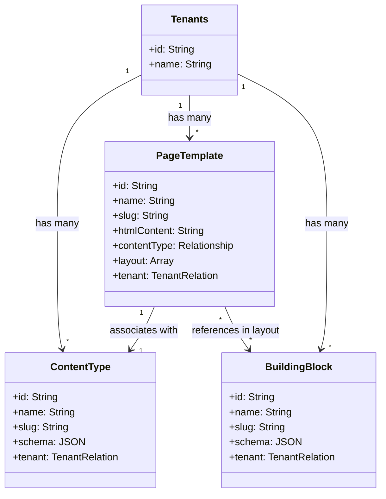

# Data Model: Template Builder Agent

This document defines the data structures and representation for entities processed by the Template Builder Agent.

## Entities

### 1. TemplateBuilderRequest (Input payload)

Used when invoking the Template Builder Agent.

```json
{
  "html_design": "string (raw HTML/CSS design text)",
  "tenant_id": "string (authenticated tenant ID)",
  "user_id": "string (creator user ID)",
  "session_id": "string? (optional trace session ID)"
}
```

### 2. GeneratedContentType (Content Type Payload)

Represents the data structure used to create or update `content-types` in Payload CMS.

```json
{
  "name": "string (e.g. Home Landing Page)",
  "slug": "string (e.g. home-landing-page)",
  "schema": {
    "name": "string (e.g. Home Landing Page)",
    "fields": [
      {
        "name": "string (e.g. hero_title)",
        "type": "string (text|textarea|richText|number|checkbox|upload)",
        "label": "string",
        "required": "boolean",
        "description": "string?"
      }
    ]
  },
  "tenant": "string (tenant ID)",
  "generatedByAI": true,
  "aiSessionId": "string"
}
```

### 3. GeneratedPageTemplate (Page Template Payload)

Represents the data structure used to create or update `page-templates` in Payload CMS.

```json
{
  "name": "string (e.g. Home Template)",
  "slug": "string (e.g. home-template)",
  "description": "string",
  "contentType": "string (Content Type database ID)",
  "archetype": "string (landing|longform|minimal)",
  "htmlContent": "string (parameterized HTML code containing {{ variables }})",
  "layout": [
    {
      "instanceId": "string (unique string)",
      "block": "string (building block database ID)",
      "mappings": "object (JSON mapping, e.g. {'title': 'hero_title'})"
    }
  ],
  "status": "draft",
  "tenant": "string (tenant ID)"
}
```

## Relationships


